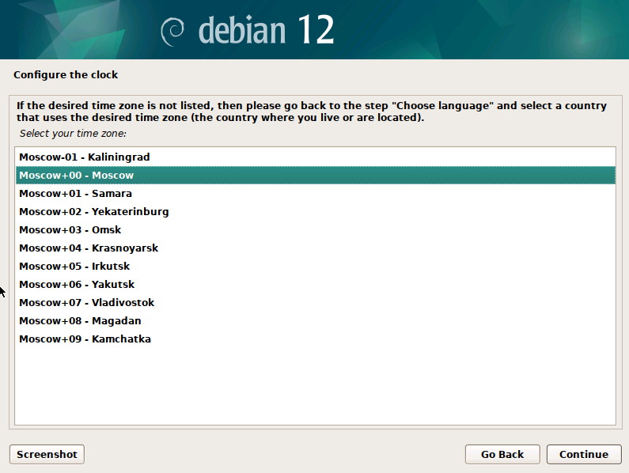
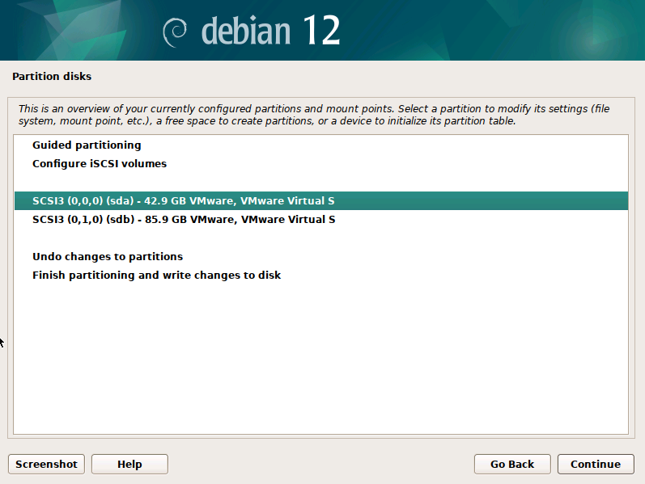

## Инструкция по подготовке компьютеров в 3 аудитории

### Установка Debian 12
> Для установки использовать образ из этого репозитория, либо с официального сайта Debian. Главное, чтобы версия совпадала.

На приветственном экране установщика выбираем графический тип установки - **Graphical install**:


Язык установщика и стандартный язык системы - **English**:


При выборе локации сначала выбираем **Other**;


В следующем меню выбираем **Europe**:


Выбираем страну **Russian Federation**:


Выбираем локаль **en_US.UTF-8**:


Раскладка клавиатуры - **American English**:


**Хостнейм** нужно установить в соответствии с номером компьютера (решите на месте) в формате 3-XX, где XX - число от 1 до 30. Пример:


Поле **Domain name** оставить пустым:


Для **root** нужно поставить пароль **kpk3ka$228**:


Полное имя нового пользователя - **student**:


**Username** аккаунта оставить аналогичным.

Паролем для новом пользователя аналогично установить **student**:


Системное время - **московское**:



При разметке дисков выбрать режим **Manual**:


Далее выбрать диск типа **nvme**, если присутствует. Если оба диска типа sd(a/b), выбрать меньший по объему:



Создаем **новую разметку диска, нажава Yes**:


Далее необходимо тыкнуть на пустое пространство (строка, оканчивающаяся на **FREE SPACE**):


Выберите пункт **Create a new partition**:


Максимальный размер оставляйте по умолчанию.

Тип разметки - **Первичный** (Primary):


Настройки тома оставить по умолчанию, как на скриншоте:


Нажать кнопку **Done setting up the partition**.

Аналогично проделать все шаги для второго диска с монтированием в **/home**, как показано ниже:


Нажать **Finish partitioning and write changes to disk**.

Установщик предупредит об отсутствии **swap** раздела. Нажимаем **No** и продолжаем:


Соглашаемся с применением всех изменений на диске:


Отказываемся от дополнительного сканирования медиа:


Для выбора ближайшего зеркала оставляем страну **Russian Federation**:


В качестве зеркала оставляем **deb.debian.org**:


Информацию о прокси не заполняем.

Отказываемся от отправки данных на аналитику:


В качестве окружения рабочего стола ставим **Cinnamon**:


Соглашаемся на установку GRUB:


Здесь выбираем диск, на которой была была установлена система (мы выбирали его первым при разметке):


---

### Работа с init.sh
После авторизации необходимо открыть терминал, перейти в режим **root** и выполнить скрипт **init.sh**, предварительно выдав ему права на исполнение:

```bash
su -
chmod +x init.sh
./init.sh
```

Скрипт представлен ниже:


Первичная инициализация:


Конец установки при всех правильно совершенных действиях должен выглядеть так:


Для удобства следует добавить новоприбываший **VMWare Workstation** на рабочий стол:


Далее запускаем его, соглашаемся с лицензионным соглашением:


Далее следует ввести ключ **MC60H-DWHD5-H80U9-6V85M-8280D** или любой другой [отсюда](https://github.com/hegdepavankumar/VMware-Workstation-Pro-17-Licence-Keys):


Далее вводим root-пароль (**kpk3ka$228**)

---

**На этом все. Установка Debian 12 и VMWare Workstation 17.5.1 завершена.**
